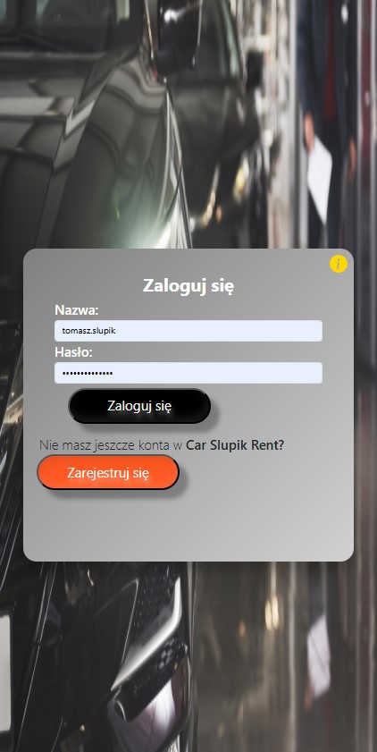
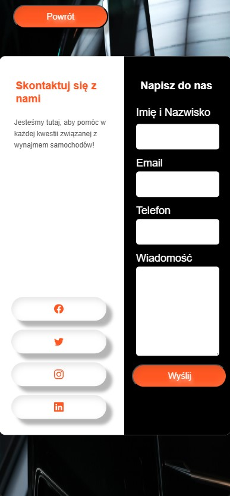
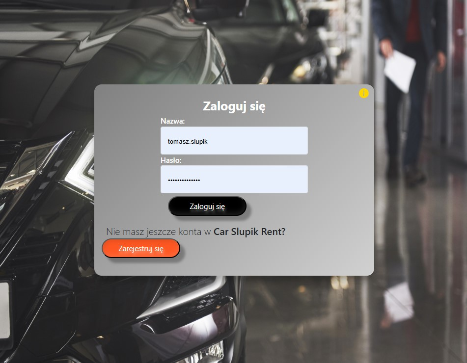
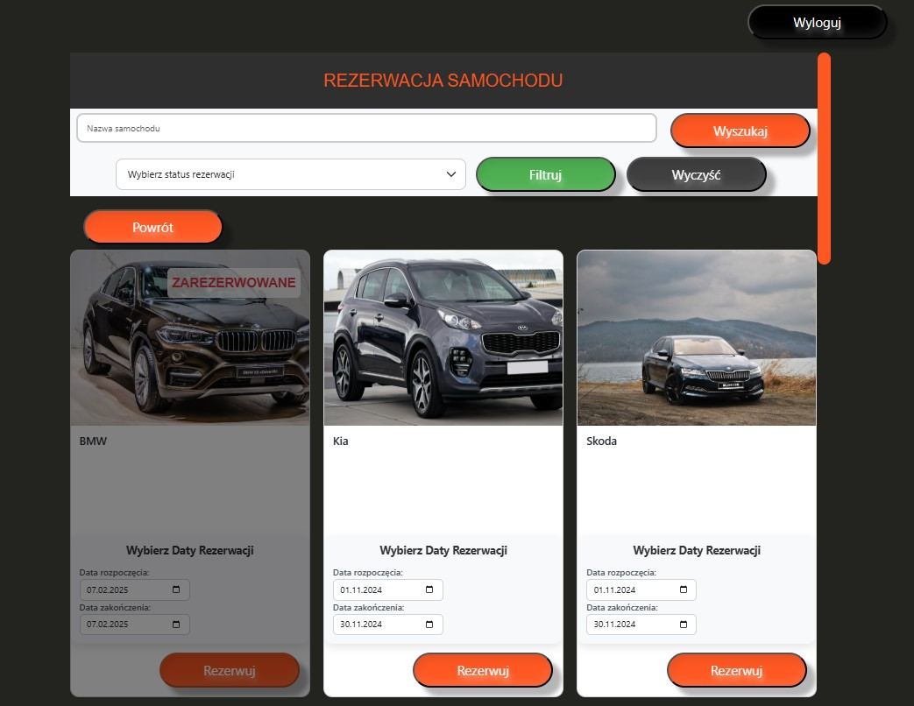
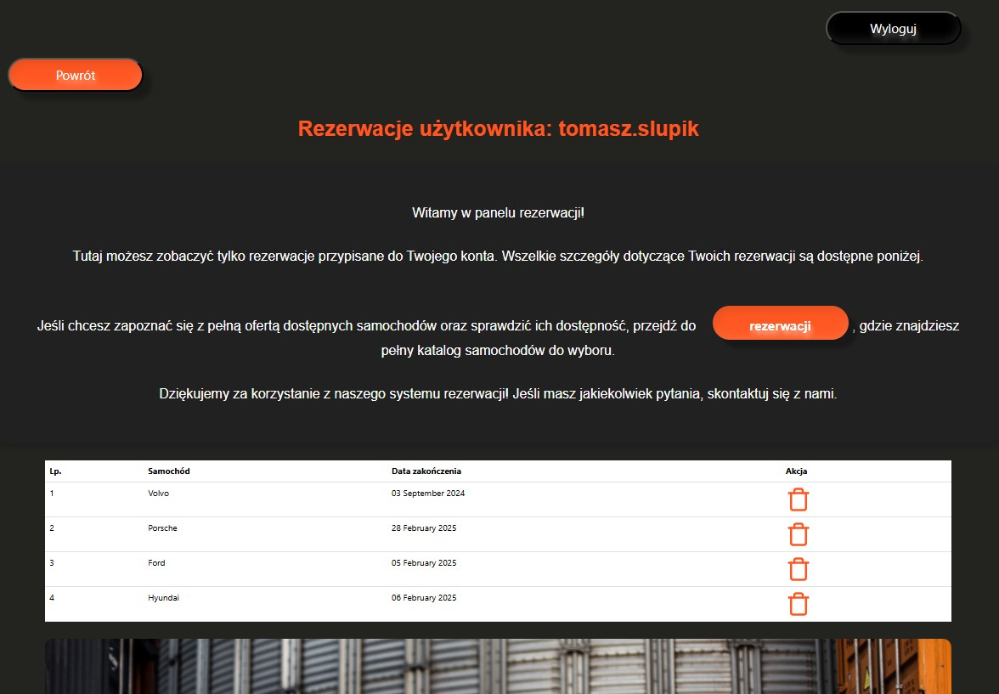

# Wypożyczalnia i rezerwaja samochodów 

Aplikacja to innowacyjne rozwiązanie, które umożliwia łatwe rezerwowanie i wypożyczanie samochodów. Oferuje szeroki wybór pojazdów, w tym SUV-y, kombi oraz sedany, dostosowanych do różnych potrzeb i preferencji użytkowników.

Użytkownicy mają możliwość przeglądania swoich rezerwacji w intuicyjny sposób, co zapewnia pełną kontrolę nad planowanymi podróżami. Dodatkowo, aplikacja umożliwia zwalnianie rezerwacji w prosty sposób, co zwiększa elastyczność korzystania z usług.

Zachęcam również do dzielenia się swoimi opiniami na temat dokonanych rezerwacji. Twoje uwagi są niezwykle cenne i pomagają doskonaleniu. Dołącz do społeczności i ciesz się komfortem podróży, jaki oferuje aplikacja! 

## Funkcje i Opis Działania

### 1. Dostępność Aplikacji

Aplikacja jest dostępna wyłącznie dla **zarejestrowanych użytkowników**. Aby mieć możliwość przeglądania rezerwacji oraz dokonywania rezerwacji samochodów, konieczne jest zalogowanie się na swoje konto.

W przypadku braku konta, użytkownicy mają możliwość szybkiej i łatwej rejestracji. Po założeniu konta zyskasz dostęp do pełnej funkcjonalności aplikacji oraz indywidualnych ustawień, co umożliwi Ci dostosowanie doświadczeń do własnych potrzeb. Serdecznie zapraszamy do rejestracji.

### 2. Usunięcie Tokenu i Komunikaty Błędów

W przypadku **utraty ważności tokenu** sesji użytkownik otrzymuje odpowiedni komunikat informujący o konieczności ponownego zalogowania się: **Musisz być zalogowany, aby korzystać z aplikacji.** System automatycznie wygeneruje komunikat informujący o wygaśnięciu sesji i przekieruje użytkownika do strony logowania.

### 3. Responsywność

Aplikacja jest **responsywna**, co oznacza, że dostosowuje się do różnych urządzeń, w tym komputerów stacjonarnych, laptopów, tabletów oraz urządzeń mobilnych. Interfejs użytkownika zapewnia wygodne korzystanie zarówno na platformach webowych, jak i mobilnych.

### 4. Główny Panel Aplikacji

W głównym panelu aplikacji użytkownicy mają do wyboru cztery kluczowe moduły: **O nas**, **Rezerwacje**, **Opinie** oraz **Kontakt**.

- **O nas**: W tym module znajdują się szczegółowe informacje o wypożyczalni.

- **Rezerwacje**: Moduł ten pozwala na przeglądanie dostępnych pojazdów oraz dokonywanie rezerwacji na konkretne daty. Użytkownicy mogą łatwo zarezerwować wybrany samochód, co sprawia, że proces jest szybki i wygodny.

- **Opinie**: W tej sekcji użytkownicy mają możliwość dodawania własnych opinii dotyczących korzystania z usług. 

- **Kontakt**: Moduł ten zawiera formularz kontaktowy, który umożliwia łatwe skontaktowanie się z firmą w przypadku pytań lub potrzeb związanych z usługami.

Dodatkowo, w górnej części panelu znajduje się sekcja użytkownika, w której można przeglądać własne rezerwacje oraz zarządzać nimi, w tym zwalniać rezerwacje, co zapewnia pełną kontrolę nad planowanymi podróżami.

### 5. Technologie

Aplikacja została zbudowana z wykorzystaniem następujących technologii:
- **Django** – wykorzystywany do tworzenia backendu aplikacji, obsługujący logikę biznesową, autentykację, rezerwację samochodów oraz interakcję z bazą danych.
- **Sqlite3** – domyślnie użyto bazę, która przychodzi z Django, służąca do przechowywania informacji o rezerwacjach użytkownikach.
- **Bootstrap** – framework CSS, który został użyty do szybkiego prototypowania oraz tworzenia responsywnych interfejsów użytkownika.

## Wykorzystane technologie i narzędzia

[](https://skillicons.dev)


## Opis folderów:

### car_django

Główny projekt aplikacji znajduje się w **car_django**.

### pozostałe foldery

Są to poszczególne mikroserwisy dla aplikacji. 


## Przykładowe screenshots:

### Mobilna wersja 







### Desktopowa wersja 








## Testy:

Aplikacja zawiera kompleksowe testy jednostkowe (Unit Tests), które zapewniają prawidłowe działanie każdego mikroserwisu. Każdy komponent systemu został starannie sprawdzony, aby zagwarantować jego poprawność oraz stabilność. Dzięki zastosowaniu testów, możliwe jest szybkie identyfikowanie i rozwiązywanie potencjalnych problemów, co przekłada się na wysoką jakość i niezawodność aplikacji.

Aby uruchomić wszytskie testy:

```bash
npm run test
```


## Instalacja

### Aby pobrać repozytorium:

```bash
  git clone https://github.com/TomaszSlupik/car_django_booking.git
```

### Instalacja zależności:

```bash
  npm install
```

### Uruchomienie Django:

```bash
  npm run start
```

lub 

```bash
py manage.py runserver
```

### Włączenie i kompilacja wszystkich styli scss:

```bash
npm run watch_sass
```


## Developer

- Tomasz Słupik


